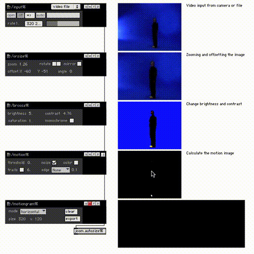

# The Musical Gestures Toolbox for Max

This is a collection of tools for analysing and visualising video in realtime. It developed in and for the graphical programming environment Max/MSP/Jitter.

The toolbox is probably most useful for people that already are experienced Max programmers. People looking for similar functionality should check out some of the [standalone applications](https://www.uio.no/ritmo/english/research/labs/fourms/software/musicalgesturestoolbox/) we have built based on the toolbox.

## Documentation

- [Video tutorials](https://www.uio.no/ritmo/english/research/labs/fourms/software/musicalgesturestoolbox/mgt-max/index.html)
- [A list of components and modules](https://github.com/fourMs/MGT-max/wiki)
- [Details about the implementation and usage](https://www.duo.uio.no/handle/10852/27149)

## History

This was the original [Musical Gestures Toolbox](https://www.uio.no/ritmo/english/research/labs/fourms/software/musicalgesturestoolbox/). The patches were developed 2004-2007 and haven't been updated since. They should, however, probably still work, although there may be some dependency issues.

Starting from 2006, the patches were embedded within the [Jamoma](http://jamoma.org/) framework. Later there is also a version of MGT for [Matlab](https://github.com/fourMs/MGT-matlab) and [Python](https://github.com/fourMs/MGT-python).

The software is currently maintained by the [fourMs lab](https://github.com/fourMs) at [RITMO Centre for Interdisciplinary Studies in Rhythm, Time and Motion](https://www.uio.no/ritmo/english/) at the University of Oslo.

## Reference

The Musical Gestures Toolbox was first described in:

- Jensenius, A. R., Godøy, R. I., & Wanderley, M. M. (2005). [Developing tools for studying musical gestures within the Max/MSP/Jitter environment](https://www.duo.uio.no/handle/10852/26907). Proceedings of the International Computer Music Conference, 282–285.

Details of the implementation and usage was presented in more detail in this Ph.D. dissertation:

- Jensenius, A. R. (2007). [Action–Sound: Developing Methods and Tools to Study Music-Related Body Movement](http://urn.nb.no/URN:NBN:no-18922). PhD thesis, University of Oslo.

## Credits

Main developer: [Alexander Refsum Jensenius](http://people.uio.no/alexanje).

## License

This software is open source, and is shared with [The GNU General Public License v3.0](https://www.gnu.org/licenses/gpl-3.0.html).
